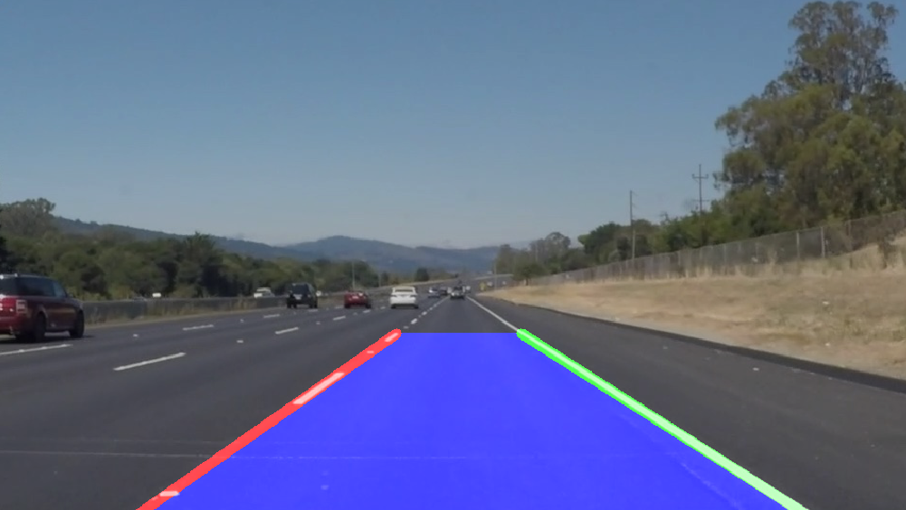

# Lane_Detection_using_OpenCV

## Install
```bash
git clone
cd Lane_Detection_using_OpenCV

# install dependencies
pip install -r requirements.txt
```

## Run
```commandline
# video
python main.py --video --filepath=path_to_video

# image
python main.py --image --filepath=path_to_image
```

## Result


